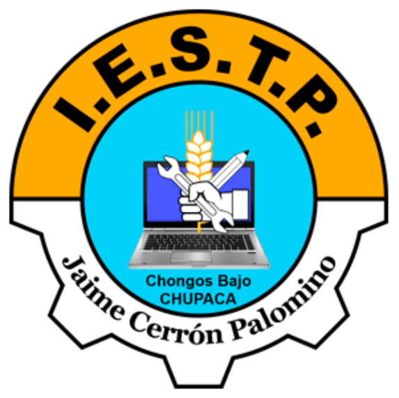

# 📘 Clase: Introducción a Markdown y su uso en proyectos con IA (Kiro.dev)

## 🎯 Objetivo de la clase
Comprender qué es **Markdown**, aprender su **sintaxis básica**, reconocer su **importancia en la documentación profesional** y entender cómo se usa en entornos de desarrollo colaborativo e inteligencia artificial, como **Kiro.dev**.

---

## 🧠 ¿Qué es Markdown?

**Markdown** es un lenguaje de marcado ligero que permite **dar formato a texto de manera simple** usando solo caracteres comunes del teclado (como `#`, `*`, `-`, etc.).  
Fue creado por **John Gruber** con el objetivo de que los documentos sean **fáciles de leer en texto plano** y **fáciles de convertir a HTML** para su publicación en la web.

📌 En pocas palabras:  
Markdown te permite escribir documentos, apuntes o documentación técnica **sin depender de procesadores de texto complejos** y manteniendo una estructura profesional.

---

## 🧱 Sintaxis básica de Markdown

Aquí se muestran los **componentes más usados**, con ejemplos que tus alumnos pueden probar directamente en Visual Studio Code o un editor online como [https://markdownlivepreview.com](https://markdownlivepreview.com):

| Elemento | Símbolo | Ejemplo | Resultado |
|-----------|----------|----------|------------|
| **Título principal** | `#` | `# Mi Proyecto` | # Mi Proyecto |
| **Subtítulo** | `##` | `## Descripción` | ## Descripción |
| **Negrita** | `**texto**` | `**Importante**` | **Importante** |
| **Cursiva** | `*texto*` | `*Ejemplo*` | *Ejemplo* |
| **Lista con viñetas** | `-` o `*` | `- Elemento 1` | - Elemento 1 |
| **Lista numerada** | `1.` | `1. Paso uno` | 1. Paso uno |
| **Enlace** | `[texto](url)` | `[Visita Mina365](https://mina365.pe)` | [Visita Mina365](https://mina365.pe) |
| **Imagen** | `` | `` |  |
| **Código en línea** | `` `código` `` | `` `echo "Hola"` `` | `echo "Hola"` |
| **Bloque de código** | ``` ``` ``` | ```php echo "Hola"; ``` | Bloque de código |
| **Cita o bloque destacado** | `>` | `> Nota importante` | > Nota importante |

📘 **Ejemplo práctico**

```markdown
# Registro de Pesaje de Cuyes

Este proyecto fue desarrollado por el grupo **AnimalTech**.

## Funciones principales
- Registro de peso por posa.
- Cálculo del promedio de peso.
- Exportación a CSV.

> Este proyecto forma parte del curso de *Diseño y Programación Web*.
```
# Registro de Pesaje de Cuyes

Este proyecto fue desarrollado por el grupo **AnimalTech**.

## Funciones principales
- Registro de peso por posa.
- Cálculo del promedio de peso.
- Exportación a CSV.

> Este proyecto forma parte del curso de *Diseño y Programación Web*.
