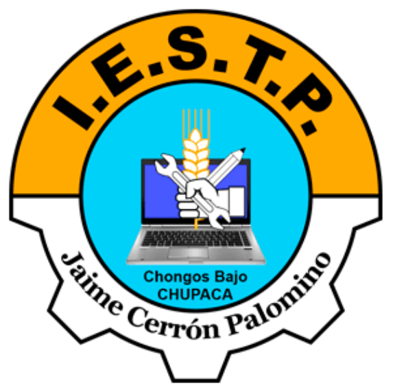

# 📘 Clase: Uso y Repaso de Markdown

## 🎯 Objetivo
Aprender la sintaxis básica de **Markdown** para crear documentos claros, estructurados y listos para usar en GitHub.

## 🧠 ¿Qué es Markdown?
**Markdown** es un lenguaje de marcado ligero que permite dar formato al texto usando caracteres comunes como `#`, `*`, `-` o `` ` ``.  
Se usa ampliamente para escribir archivos `README.md`, documentación técnica y textos explicativos en proyectos de software.

## 🧱 Sintaxis básica

| Elemento | Ejemplo | Resultado |
|-----------|-----------|------------|
| Título principal | `# Mi Proyecto` | # Mi Proyecto |
| Subtítulo | `## Descripción` | ## Descripción |
| Negrita | `**Importante**` | **Importante** |
| Cursiva | `*Ejemplo*` | *Ejemplo* |
| Lista con viñetas | `- Elemento 1` | - Elemento 1 |
| Lista numerada | `1. Paso 1` | 1. Paso 1 |
| Enlace | `[Visita Mina365](https://mina365.pe)` | [Visita Mina365](https://mina365.pe) |
| Imagen | `` |  |
| Código en línea | `` `echo "Hola"` `` | `echo "Hola"` |
| Bloque de código | ``` ```php ... ``` ``` | Ver ejemplo abajo |

## 💻 Ejemplo de bloque de código

```php
<?php
  echo "Hola Mundo";
?>
```

## 🤖 Markdown como lenguaje para la IA
Markdown también se usa como un **lenguaje de comunicación entre el desarrollador y la inteligencia artificial**.  
Su formato estructurado permite que la IA distinga fácilmente entre texto explicativo, instrucciones y código.

```markdown
# Crear módulo de registro
## Objetivo
Registrar usuarios en una base de datos.

### Pasos
1. Crear formulario HTML.
2. Validar datos.
3. Guardar información.

```php
<?php
  echo "Usuario registrado correctamente.";
?>
```
```

## 🧠 Conclusión
Markdown es una herramienta esencial para documentar proyectos y comunicar ideas de forma profesional.  
Su sintaxis simple mejora la claridad, la presentación y la interacción con herramientas modernas e inteligencia artificial.

© 2025 – Curso **Diseño y Programación Web**  
**IESTP Jaime Cerrón Palomino – Chongos Bajo (Junín, Perú)**  
Docente: **Gustavo [Apellido]**
